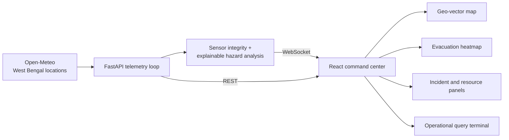

# TRINETRA

### A live disaster-response command center for West Bengal

<p align="center">
	<strong>See the signal. Understand the risk. Move the response.</strong>
</p>

<p align="center">
	<a href="https://github.com/anushkachatterjee07-ui/Trinetra/stargazers"></a>
	<a href="https://github.com/anushkachatterjee07-ui/Trinetra"></a>
	
	
</p>

<p align="center">
	Trinetra turns live environmental signals into an operational picture for incident triage, evacuation planning, and responder coordination across West Bengal.
</p>

---

## The idea

During a flood, cyclone, heat event, or seismic disruption, the difficult part is not collecting another number. It is turning scattered signals into the next useful decision.

Trinetra is designed as that decision layer:

- **Live telemetry** from West Bengal locations through Open-Meteo
- **Explainable hazard analysis** for flood, wildfire, windstorm, and earthquake indicators
- **Responder coordination** with availability, dispatch, and on-scene state
- **Evacuation intelligence** with clearance-time zones and route conditions
- **Operational answers** for shelters, emergency contacts, flood survival, and evacuation protocols

> **Built for the last mile of response:** from a sensor reading to a route, a resource, and a human-safe action.

## Why it stands out

| Signal | Decision | Action |
| --- | --- | --- |
| Rainfall, wind, temperature, humidity, seismic activity | Rule-based threat analysis with severity and impact score | Surface the incident and update the command log |
| District-aware weather and location data | Current operational sector and map context | Keep the response grounded in West Bengal geography |
| Active incidents and available assets | Resource allocation and dispatch state | Move the right responder toward the right incident |
| Live telemetry quality | Computed sensor integrity score | Make confidence visible instead of hiding data quality |

## Command center capabilities

### Live operational picture

- Tactical dashboard with system health, AI state, active alerts, and sensor integrity
- WebSocket telemetry stream with automatic reconnect behavior
- Real-time command log for system, incident, and resource events
- Live REST endpoints for incidents, resources, routing, and heatmap data

### West Bengal intelligence layer

- Kolkata and Howrah urban corridors
- Digha and Purba Medinipur coastal risk
- Siliguri and Darjeeling highland logistics
- Sundarbans and South 24 Parganas coastal shelter context
- District-aware emergency contacts, shelters, evacuation guidance, and flood survival protocols

### Evacuation heatmap

Switch from the standard vector view to **Evacuation Heatmap** to inspect projected clearance zones:

- Fast clearance
- Moderate clearance
- Slow clearance

The zones respond to current rainfall, wind speed, active incidents, and available responder assets.

### Operational query terminal

Ask the dashboard questions in natural language, such as:

```text
Where is the nearest elevated flood shelter in South 24 Parganas?
```

```text
If a flood happens here today, which roads should remain open?
```

Responses are rendered as structured operational data, including corridors, blocked segments, shelters, protocols, and emergency contacts.

## Architecture



## Tech stack

| Layer | Tools |
| --- | --- |
| Frontend | React 19, TypeScript, Vite, Tailwind CSS, Lucide icons |
| Backend | Python, FastAPI, Pydantic, Uvicorn |
| Live transport | WebSocket telemetry plus REST APIs |
| Weather source | Open-Meteo with West Bengal-specific fallback modeling |
| Analysis | Explainable rule-based disaster analyzer |
| Testing | Python `unittest`, TypeScript build validation |

## Run locally

### 1. Start the backend

```powershell
cd backend
python -m venv .venv
.\.venv\Scripts\Activate.ps1
pip install fastapi "uvicorn[standard]" pydantic
python -m uvicorn main:app --reload --host 0.0.0.0 --port 8002
```

The API is available at `http://127.0.0.1:8002`.

Useful endpoints:

```text
GET  /health
GET  /api/incidents
GET  /api/resources
GET  /api/ops/routing-analysis
GET  /api/ops/evacuation-heatmap
WS   /ws/telemetry
```

### 2. Start the frontend

Open a second terminal:

```powershell
cd frontend
npm install
npm run dev -- --host 0.0.0.0 --port 4173
```

Open `http://localhost:4173` in a browser.

### 3. Run checks

```powershell
cd backend
python -m unittest discover -s tests -p "test_*.py"

cd ..\frontend
npm run build
```

No Open-Meteo API key is required for the default weather integration.

## Deploy the frontend to Vercel

Trinetra uses Vercel for the React frontend and a separate public host for the FastAPI service. The backend needs a long-running process and WebSocket support, so it should not be deployed as a static Vercel page.

1. Import this repository into Vercel.
2. Set the Vercel **Root Directory** to `frontend`.
3. Keep the default Vite build settings:
	- Build command: `npm run build`
	- Output directory: `dist`
4. Add this production environment variable:

```text
VITE_API_BASE_URL=https://your-public-backend.example.com
```

5. Deploy. The value must point to the public FastAPI origin, without a trailing slash. The dashboard will derive the secure WebSocket endpoint automatically at `/ws/telemetry`.

For the backend, use a host that supports persistent WebSockets, then allow the Vercel domain in CORS when moving beyond the current demo configuration.

The local frontend configuration is documented in [frontend/.env.example](frontend/.env.example).

## Project map

```text
Trinetra/
├── backend/
│   ├── engines/
│   │   ├── disaster_analyzer.py
│   │   ├── resource_allocator.py
│   │   └── weather_provider.py
│   ├── models/
│   ├── tests/
│   └── main.py
└── frontend/
		├── src/components/
		│   ├── CommandCenter.tsx
		│   ├── GeoMap.tsx
		│   ├── ActiveIncidents.tsx
		│   ├── ResourceStatus.tsx
		│   ├── RealTimeLog.tsx
		│   └── TerminalFeed.tsx
		└── src/services/
				├── api.ts
				└── websocket.ts
```

## Demo path for judges

1. Open the dashboard and watch the telemetry link move online.
2. Switch to **Evacuation Heatmap** and show the clearance zones.
3. Open the responder panel and dispatch an available asset.
4. Ask the terminal for a shelter, evacuation protocol, or flood route assessment.
5. Point out the changing district sector, live weather provider, sensor integrity, and command log.

## Responsible design note

Trinetra is a decision-support prototype, not a replacement for official district administration, emergency services, or human command. Its analysis is intentionally visible and explainable so operators can inspect the signals behind each recommendation.

## License

This project is currently shared for demonstration and evaluation. Add a formal license before distributing it for production use.

---

<p align="center">
	<strong>TRINETRA</strong><br>
	<sub>Operational clarity for a changing ground reality.</sub>
</p>
